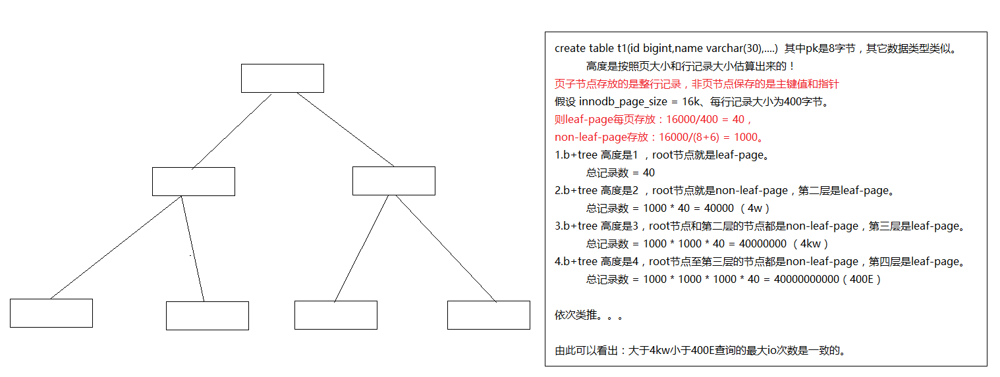

## 高度计算

#### 假设
    一个页大小：16K（配置的，默认是16K）
    一行记录的平均大小：400字节
（怎么查看一行记录的平均大小：show table status like ‘tb_name’中的Avg_row_length。计算方式： 一个页的大小/一个页中的总记录数page / total）
一个页能存放多少记录？大约16K/400 = 40条
#### 键值大小
non-leaf-page（非页节点）保存的索引的键值和指针
leaf-page（页节点）保存的是整行记录

mysql中的一个pointer（指针）大小固定为：6字节

假设一个索引的键值是bigint =>8字节
那么一个非页节点能存放多少条（key,pointer）？ => 16K/(8+6) = 1000

高度为1时：叶子节点[leaf page]就是根节点[root page]

B+ tree 高度为1，那么能存放多少条记录？ => 40（40）
B+ tree 高度为2，那么能存放多少条记录？ => 40*1000（4W）
B+ tree 高度为3，那么能存放多少条记录？ => 40*1000*1000（4000W）
B+ tree 高度为4，那么能存放多少条记录？ => 40*1000*1000*1000（400E）

由此可以反推出大致B+Tree的高度

如图所示

