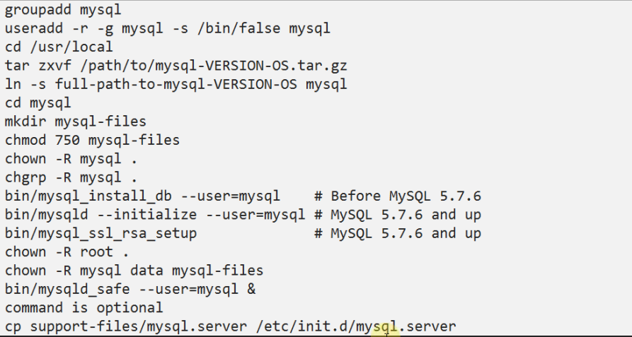

## 这是一篇在Linux下使用通用二进制安装包安装的简单教程

请点击[这里](http://cdn.mysql.com//Downloads/MySQL-5.7/mysql-5.7.17-linux-glibc2.5-x86_64.tar.gz)下载64位版本

### 安装步骤

1.  解压 tar zxf mysql-5.7.17-linux-glibc2.5-x86_64.tar.gz /opt/mysql-5.7.17
2.  cd mysql-5.7.17-linux-glibc2.5-x86_64
3.	ls support-files/ 下面全是一些可执行脚本
4.	mv mysql-5.7.17-linux-glibc2.5-x86_64 /usr/local/
5.	创建快捷连接 ln -s mysql-5.7.17-linux-glibc2.5-x86_64 mysql
6.	groupadd mysql
7.	useradd mysql -g mysql
8.	chown -R root:mysql . （为了让MySQL数据库只让root和mysql用户使用）
9.	修改或者添加 /etc/my.cnf [文件](my.cnf)
10.	bin/mysqld --initialize（初始化一些MySQL的系统表）
11.	cp support-files/mysql.server /etc/init.d/mysqld 
12.	启动mysql服务器 /etc/init.d/mysqld start
13.	登录mysql  bin/mysql -p”`error.log中的临时密码`”
14.	添加MYSQL_HOME到PATH

#### 官方安装示例
 

### 注意点

1. 不要将MySQL解压到`~`下，否则在加载plugin时，会报无权限的错误
2. my.cnf文件的加载顺序 使用 mysql --help |grep my.cnf 可以看到，最后一个文件中的配置将会替换之前位置的配置
