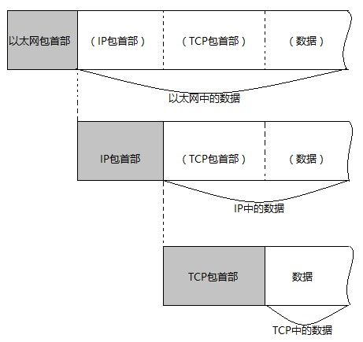
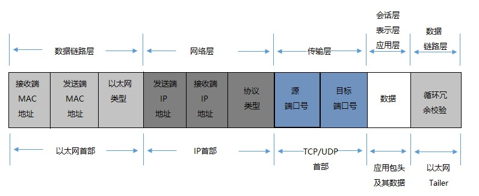
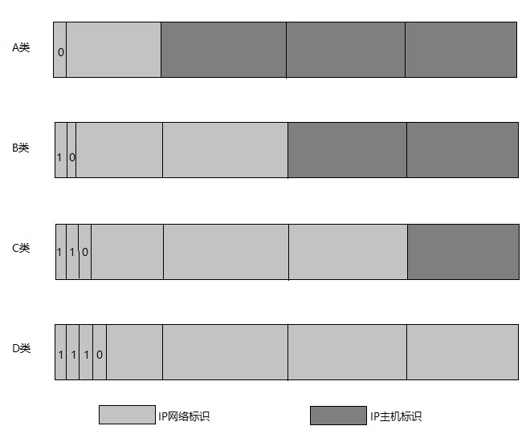
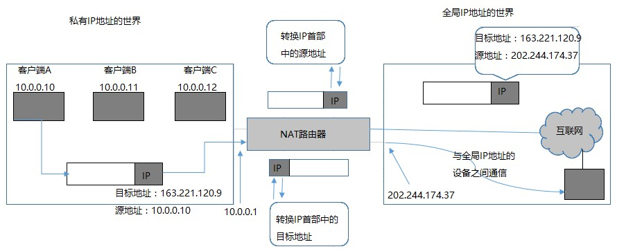
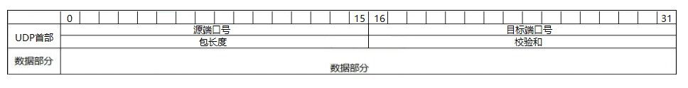
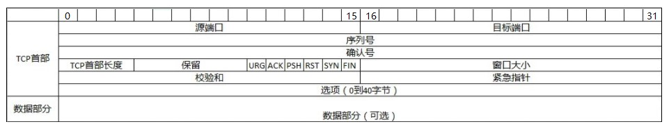

# 1. 网络基础知识

## 1.1 协议

### 1.1.1 协议类型

### 1.1.2 分组交换

### 1.1.3 协议分层

## 1.2 OSI模型

### 1.2.1 七层通信

### 1.2.2 会话层以上

### 1.2.3 传输层以下

## 1.3 传输方式

### 1.3.1 有连接和无连接

### 1.3.2 电路交换和分组交换

### 1.3.3 接收端数量

## 1.4 地址

通信传输中，发送端和接收端可以被视为通信主体。

一般使用MAC地址、IP地址、端口号等作为地址标识。

### 1.4.1 地址的唯一性

同一个通信网段中不允许有两个相同的通信主体存在。

一般IP、MAC等都是唯一的。

单播、多播、任播等都要求通信地址具有唯一性。

### 1.4.2 地址的层次性

目的：方便快速找到通信地址。

IP地址具备层次性。

MAC地址虽然是唯一的，但是不具备层次性。

MAC地址一般由厂商针对网卡进行指定。

IP地址包括：网络号和主机号。

若主机号不同，但是网络号相同，说明它们处于同一个网段。

网络传输中，每个节点会根据分数数据的地址信息，来判断该报文应该由哪个网卡发送出去。寻址时，各个地址会参考一个发出接口列表。

MAC寻址：地址转发表

IP寻址：路由控制表

## 1.5 网络的构成要素

计算机网络指：计算机鱼计算机之间相连而组成的网络。

搭建网络的设备：网卡、中继器、网桥、路由器、4~7层交换机、网关

### 1.5.1 网卡

也叫网络适配器、网卡、LAN卡等，一般插在计算机扩展总线上。

一般是硬件设备。

### 1.5.2 中继器

在OSI第一层上，物理层面上的延长网络的设备。

通常是用来将电缆传递过来的电信号或光信号经由中继器的波形调整和放大之后再传给另一个电缆（即：信号在 0 和 1 之间转换）。

中继器可以提供多个端口服务，这种被成为集线器，每个端口是一个中继器。

### 1.5.3 网桥（2层交换机）

在OSI第二层，数据链路层上连接两个网络的设备。

能够识别数据帧，并将数据帧临时存储在内存，再重新生成信号作为一个全新的帧转发给另外一个网段。

网桥会根据 **地址自学机制** 和 **过滤功能** 控制网络流量。

地址指：MAC地址、硬件地址、物理地址、适配器地址。

网桥是根据物理地址进行处理

### 1.5.4 路由器（3层交换机）

在OSI第三层，网络层面上连接两个网络、并对分组报文进行转发的设备。

路由器根据IP地址进行处理。

路由器能连接不同的数据链路，分担网络负荷，具备一定的网络安全功能能。

### 1.5.5 交换机（4~7层交换机）

负责处理OSI模型中从传输层到应用层的数据。

如TCP/IP中，就是以TCP协议的传输层以及其以上的应用层之间的处理。

### 1.5.6 网关

负责OSI模型中从传输层到应用层之间的数据转换。（ **负责数据转换** ）

类似于适配器，来适配各种数据。

# 2. TCP/IP基础知识

即：TCP（Transmission Control Protocol）和IP（Internet Protocol）

| 7 应用层   | TELNET、SSH、HTTP、SMTP、POP、SSL/TLS、FTP、MIME、HTML、SNMP、MIB、… |
| ------- | ---------------------------------------- |
| 6 表示层   |                                          |
| 5 会话层   |                                          |
| 4 传输层   | TCP、UDP、UDP-Lite、SCTP、DCCP               |
| 3 网络层   | ARP、IPv4、IPv6、ICMP                       |
| 2 数据链路层 | 以太网、WLAN、…                               |
| 1 物理层   |                                          |

## 2.1 TCP/IP 规范-RFC

RFC：Request For Comment。

通过编号来组织每个协议的标准化。

标准化具备特性：

 开放性：任何人都可以加入讨论

 实用性：先实现，然后加入到标准中

## 2.2 互联网

互联网中的每个网络都由骨干网（BackBone）和末端（Stub）网组成。

每个网络通过NOC（Network Operation Center）相连。

如果网络的运营商不同，它的网络连接方式和使用方式也不同。通过IX（Internet Exchange）的支持，来实现异构网络的互联。

连接互联网须向ISP（Internet Service Provider）申请。

## 2.3 TCP/IP 协议分层

### 2.3.1 TCP/IP与OSI参考模型

| 应用层   | 应用层DNS、URI、HTML、HTTP、TLS/SSL、SMTP、POP… | 应用程序        |
| ----- | -------------------------------------- | ----------- |
| 表示层   |                                        |             |
| 会话层   |                                        |             |
| 传输层   | 传输层TCP、UDP、SCTP、DCCP                   | 操作系统        |
| 网络层   | 互联网层ARP、IP、ICMP                        |             |
| 数据链路层 | 网卡层                                    | 设备驱动程序和网络接口 |
| 物理层   | （硬件）                                   |             |

### 2.3.2 硬件（物理层）

类似与以太网或者电话线等设备

### 2.3.3 网络接口层（数据链路层）

利用以太网中的数据链路层进行通信，因此属于接口层。即：驱动程序

### 2.3.4 互联网层（网络层）

互联网层使用IP协议，IP协议基于IP地址转发分包数据。

TCP/IP 分层中的互联网层和网络层通常由操作系统提供，尤其是路由器，必须实现通过互联网层转发分组数据的功能。

互联网层的所有主机或路由器必须实现IP功能。

#### 2.3.4.1 IP

跨越网络传输数据包，使整个互联网都能收到数据的协议。

隐藏了数据链路层的功能，但是它不具备重发机制，即使分组数据包未达到对端主机也不会重发，属于非可靠性传输协议。

#### 2.3.4.2 ICMP

发送异常通知给发送端，通常用来诊断网络。

#### 2.3.4.3 ARP

从分组数据包中解析出物理地址（MAC地址）的协议

### 2.3.5 传输层

让应用程序之间实现通信。

最常使用的是TCP和UDP

#### 2.3.5.1 TCP

面向有连接的传输层协议。能正确处理传输过程中丢包、传输乱序等问题。

为了确保数据包可达，最少需要7次发包收包（建立连接3次，断开连接4次）。

不利于视频会议（音频、视频）等场合

#### 2.3.5.2 UDP

面向无连接的传输层协议。不关注对端是否真正收到了传过去的数据，如果需要确保分包数据，需要在应用程序中实现。

通常用于分组数据较少或者多播、广播以及视频通信等场合

### 2.3.6 应用层（会话层以及以上的分层）

TCP/IP应用大多数都是client/server模型。

例如：

#### 2.3.6.1 WWW

通常使用的协议是HTTP（HyperText Transfer Protocol），传输的内容是HTML（HyperText Markup Language），而HTTP属于应用层协议，HTML属于表示层协议。

#### 2.3.6.2 E-MAIL

邮件应用

#### 2.3.6.3 FTP

文件传输，可以是文本文件或者二进制文件

## 2.4 TCP/IP分层模型和通信示例

### 2.4.1 数据包首部

在每个分层中，都会对发送的数据附加一个首部，通常包含目标地址、协议相关信息。

包：全能性术语

帧：表示数据链路层中包的单位

数据报：IP和UDP等网络层以上的分层中包的单位

段：TCP数据流中的信息

消息：应用协议中数据的单位

### 2.4.2 发送数据包

1. (1).应用程序处理

应用程序对消息编码（表示层）

是否点击发送消息（会话层）

1. (2).TCP模块处理

负责建立连接、发送数据、关闭断开连接。TCP提供将应用层数据顺利发送至对端的可靠传输。

a.添加TCP首部，包括：

 源端口号、

 目标端口号、

 序号（表示该包中数据是发送端整个数据中第几个字节的序列号）、

 校验和checksum（用于判断数据是否损坏）

b.将附加了TCP首部的包发送给IP模块

1. (3).IP模块处理

将TCP发送过来的TCP首部和TCP数据结合起来当作自己的数据。

a.添加IP首部，包括：

 接收端IP地址、

 发送断IP地址、

 TYPE（判断是TCP还是UDP）

b.参考路由控制表界定此IP包的路由或主机，

c.将IP包发送给连接这些路由器或主机网络接口的驱动程序，以便于真正发送数据。

d.如果不知道接收端的MAC地址，可以利用ARP（Address Resolution Protocol）查找。

1. (4).网络接口（以太网驱动）处理

将IP包发送过来的数据当成自己的数据。

a.添加以太网首部，包括：

 接收端MAC地址、

 发送端MAC地址、

 标识以太网类型的以太网数据的协议

b.进行发送处理

### 2.4.3 经过数据链路的数据包

 在包的最后追加以太网的包尾（Ethernet Trailer）

 每个包首部至少包含：发送端和接收端的地址，上一层的协议

### 2.4.4 接收数据包

包的接收流程是发送流程的逆序过程

1. (5).网络接口处理

主机接收到以太网包之后，首先从以太网包首部中找到MAC地址，判断是否是发给自己的包，如果不是，则直接丢弃数据。

即：如果以太网首部的类型中包含了一个无法识别的协议类型，则丢弃数据。

1. (6).IP模块处理

借助路由控制表，发送给主机

1. (7).TCP模块处理

首先计算校验和（checksum），判断数据是否被破坏，然后检查是否按照序号接收数据，最后检查端口号，确定具体的应用程序。

数据接收完毕后，接收端会发送一个确认回执给发送端

1. (8).应用程序处理

客户端应用处理自己的响应数据

# 3. 数据链路

主要介绍LAN、WLAN、PPP等

数据链路层的协议定义了通过通信媒介互连的设备之间的传输规范。

物理层把电压的高低、光的闪灭、电波的强弱等信号，转换成二进制的0、1。

数据链路层把0、1集合起来称为&quot;帧&quot;，然后进行传输。

网络拓扑（Topology）

网络的连接和构成的形态称为：网络拓扑。包括：总线型、环形、星型、网状型等。

## 3.1 数据链路相关技术

### 3.1.1 MAC地址

MAC地址用于识别数据链路中互联的节点，一般 **通过MAC地址判断目标地址** 。

MAC地址长度为 **48比特** （即： **6字节** ）

 第1位：单播（0）/多播（1）

 第2位：全局（0）/本地（1）

 第3 ~ 24位：由IEEE管理并保证各个厂家之间不重复

 第25 ~ 48位：由厂家管理并保证各个产品时间不重复

MAC地址一般是全球唯一的，如果相同，则不能存在于同一个数据链路中。

（如：虚拟机中）

### 3.1.2 通信介质

包括：双绞线电缆、同轴电缆、光纤、电波等。

#### 3.1.2.1 共享介质型网络

共享介质直连

#### 3.1.2.2 非共享介质型网络

不共享介质，通过交换机转发数据帧。

使用方式一般包括：争用方式、令牌传递方式。

#### 3.1.2.3 半双工与全双工

半双工：只发送或只接收的通信方式

全双工：可以同时发送和接收

## 3.2 以太网

即：Ethernet，基于网卡和驱动程序实现。

一般都采用终端鱼交换机之间独占电缆的方式进行通信。

以太网的传输速度：由时钟频率决定。

1K = 1000 1M = 1000K 1G = 1000M

### 3.2.1 以太网帧格式

前端：

 包括由8个字节组成的前导码。

 最后1个字节的末尾是11

以太网本体：

 前端是以太网首部，共14字节。

  6字节目标MAC地址，6字节源MAC地址，2字节上层协议类型。

 接着是数据，一个数据帧容纳的最大范围是46 ~ 1500个字节

尾端：FCS（Frame Check Sequence）4个字节

 用于保存整个帧除以生成多项式的余数。用于检查数据帧是否有损坏。

通常：

 比特（bit）：0或1

 字节（byte）：8个比特组成1个字节

 8位字节（byte）：只是为了强调1个字节中有8个比特。

# 4. IP协议

主要负责将数据包发送给最终的目标计算机。

主要介绍IP协议的主要功能和规范。

## 4.1 IP基础知识

IPv4、IPv6相当于OSI模型的第三层--网络层。实现终端节点之间的通信。

数据链路层主要是：在互联网同一链路节点之间进行包传递。

网络层（IP层）：在不同的数据链路层也能进行数据包传递。

### 4.1.1 IP地址属于网络层

MAC地址用于标识同一个链路中不同计算机的一种识别码。

IP地址用于在连接到网络中的所有主机中识别出通信的目标地址。

### 4.1.2 路由控制

路由控制：将分组数据发送到最终目标地址的功能。

IP包的转发也叫多跳路由，每个区间决定着下一个包被转发的路径。

路由控制表

所有主机都维护着路由控制表（Routing Table）

### 4.1.3 其它

IP是实现多个数据链路之间通信的协议。

不通数据链路最大的区别：各自的最大传输单位（MTU： Maximum Transmission Unit）

IP 面向无连接。即在发包之前，不需要建立与对端目标地址之间的连接。

采用无连接原因：实现简单、提升速度。

## 4.2 IP地址基础

在TCP/IP通信时，用IP地址识别主机和路由器。

### 4.2.1 IP地址定义

IPv4 由32位正整数表示。

由 **网络标识** （网络地址）和 **主机标识** （主机地址）两部分组成。

目前以子网掩码（网络前缀）来区分网络标识和主机标识

### 4.2.2 IP地址分类

具体划分如下图所示

### 4.2.3 子网掩码

实际就是将A类、B类、C类地址中的IP网络标识作为子网掩码

| A类   | 255. | 0.   | 0.   | 0    |
| ---- | ---- | ---- | ---- | ---- |
| B类   | 255. | 255. | 0.   | 0    |
| C类   | 255. | 255. | 255. | 0    |

子网掩码必须是IP地址的首位开始连续的 &quot; **1**&quot; 。

### 4.3 路由控制

主机和路由器一般持有路由控制表（Routing Table），类似于指路灯。

路由控制表的形成方式：管理员配置、路由器自动刷新。

路由控制表中记录着网络地址与下一步应该发送至路由器的地址。

在发送IP包时，首先确定IP包首部综合那个的目标地址，再从路由控制表中找到与该地址具有相同网络地址的记录，根据该记录将IP包转发给相应的下一个路由器。

## 4.4 IP分割与重组

### 4.4.1 MTU不同

每种数据链路的MTU不同。

如：IP：65535;LAN：1500

### 4.4.2 IP报文的分片与重组

IP分片一般由路由器完成。重组一般由目标主机完成。

## 4.5 IPv6

IPv6长度：128bit，一般是8个16位字节。

组成

每8个一组，以 : 分割，如果是多个0，则可以以 :: 分割，一个地址中最多出现一次 ::

### 4.5.1 首部格式

按照字节划分如下：

版本（Version）：0 ~ 3

通信量类（Traffic Class）：4 ~ 11

流标号（Flow Label）：12 ~ 31

有效荷载长度（Payload Length）：32 ~ 47（不包含首部）

下一个首部（Next Header）：48 ~ 55

跳数限制（Hop Limit）：56 ~ 63

源地址（Source Address）：128比特组成

目标地址（Destination Address）：128比特组成

扩展首部：

荷载：

## 4.6 IPv4

首部格式

# 5. IP协议相关技术

包括：ARP、DNS、ICMP、DHCP等

## 5.1 DNS（Domain Name Server）

利用数据库 **hosts** 实现

DNS系统：管理主机名和IP地址之间对应关系。

DNS的分层通常是一棵树。

### 5.1.1 解析器（Resolver）

进行DNS查询的主机和软件叫做DNS解析器。例如：个人电脑、工作站

### 5.1.2 DNS查询

1. 个人电脑解析本地
2. 查询上层域名服务器
3. 查询根域名服务器
4. 返回IP

解析器和域名服务器会将解析到的信息保存在缓存里。

## 5.2 ARP（Address Resolution Protocol）

根据IP地址，查询MAC地址

只适用于IPv4，不适用于IPv6。

IPv6使用ICMPv6替代ARP发送邻居探索信息。

### 5.2.1 工作机制

ARP借助ARP请求和ARP响应包来确定MAC地址。

1. **广播** 一个ARP请求包。包中包含了想要了解其MAC地址的主机IP地址。
2. ARP请求会被同一个链路中所有的主机和路由器解析。
3. 与ARP包中请求IP一致的主机，将自己的MAC地址塞入ARP响应返回给主机。

通常会把IP地址和MAC地址保存在ARP缓存表中保存一段时间。

### 5.2.2 RARP（Reverse Address Resolution Protocol）

将ARP反过来，根据MAC地址，查询IP地址。

## 5.3 ICMP

功能：确认IP包是否成功送达目标地址，通知在发送过程中IP包被废弃的的具体原因，改善网络设置。

如果在IP通信中某个IP包因为某种原因未能达到目标地址，那么这个具体的原因由ICMP来负责通知。

ICMP的消息通知也会通过IP进行发送。

消息分为：通知出错的错误消息、用于诊断的查询消息。

### 5.3.1 主要的ICMP消息

#### 5.3.1.1 目标不可达

路由器无法将IP数据包发送给目标地址时发送

#### 5.3.1.2 重定向消息

如果路由器发现发送端主机使用了次优的路径发送数据，那么它会返回一个ICMP重定向消息给这个主机。消息中包含了最合适的路由信息和源数据。

发送端主机根据重定向消息，将这个路由信息添加到自己的路由控制表中，然后重新发送数据。

#### 5.3.1.3 超时消息

IP包中有一个字段TTL（Time To Live，生存周期），它的值每经过一次路由器，就会减1，直到减到0时，该IP包将会被丢弃。此时，IP路由器会发送一个超时的消息，并通知该包已经被丢弃。

主要是为了避免IP包被无休止的在网络上被转发。

#### 5.3.1.4 回送消息

用于判断发送的数据包是否已经成功到达对端的一种消息。

例如：ping（Packet InterNetwork Grouper）命令就利用这个消息实现。

## 5.4 DHCP（Dynamic Host Configuration Protocol）

### 5.4.1 工作机制

首先需要架设DHCP服务器，

然后将DHCP所要分配的IP地址设置到服务器上，

还要将对应的子网掩码、路由控制信息以及DNS服务器的地址设置到服务器上。

使用：

DHCP客户端广播DHCP请求包，DHCP服务器收到之后，返回DHCP提供包。

DHCP包的目标地址：255.255.255.255，源地址：0.0.0.0。因为DHCP在即插即用时，IP地址尚未确定。

如果DHCP服务器遇到故障，则无法自动分配IP地址。

### 5.4.2 DHCP中继代理

家庭网络中，一般由路由器充当DHCP的角色。

类似于proxy模式

## 5.5 NAT（Network Address Translator）

用于在本地网络中使用私有地址，在连接互联网时使用全局IP的技术。

还有可以转换TCP、UDP的NAPT（Network Address Ports Translator）技术

### 5.5.1 NAT工作机制

如下图所示：

NAT路由器内部有一张自动生成的用来转换地址的表。

在使用TCP、UDP通信时，只有目标地址、目标端口、源地址、源端口、协议类型五项内容都一致时，才被认为是同一个通信连接。使用的是NAPT

建立TCP连接首次握手时的syn包一发出，就会生成路由表，关闭连接时发出fin包时，删除表。

## 5.6 IP隧道

I

IPv4和IPv6之间无法直接通信，为了解决这个问题，引入了IP隧道。

如：

IPv6（网络A） IPv4（网络B）  IPv6（网络C）

本来是无法进行通信的，通过IP隧道技术来解决。

通过隧道来包装IP包

在数据的首部，再追加网络层首部。

# 6. TCP和UDP

TCP和UDP是OSI的传输层协议。

TCP提供可靠的通信传输，UDP不提供可靠的传输，通常用于广播、多播、视频等。

## 6.1 传输层作用

### 6.1.1 通信处理

在TCP/IP通信中，上层必须向下层提供传输的地址。

因此传输层使用端口号（port）来识别上层应用。

TCP/IP的众多应用协议大多以Client/Server的形式运行。

### 6.1.2 两种传输层协议TCP和UDP

TCP

 面向有连接的、可靠的流协议。

 提供可靠性传输，实行：顺序控制、重发控制机制。

UDP

 面向无连接的，非可靠性的数据报协议。

 可以确定发送消息的大小，但是不保证消息一定会到达。如果需要确认，则需要应用根据需要自行处理。

使用时，需要按照不同场景，选择合适的协议进行处理。

底层是由操作系统实现的：**send()**和**recv()**

## 6.2 端口号

**MAC地址** ：识别数据链路层中的不同的计算机。

**IP地址** ：识别TCP/IP网络中不同的主机和路由器。

**PORT** ：识别同一台计算机中进行通信的不同应用程序。

端口的作用是：识别不同应用程序。

仅凭端口是不够的，通常使用：源IP地址、源端口号、目标IP地址、目标端口号、协议号。

### 6.2.1 端口号确定

知名端口号：0 ~ 1023

 如：

 7 echo

 22  ssh

 80  http

 443 https

标准端口号：1024 ~ 49151

动态分配：49152 ~ 65535 【16383个】

## 6.3 UDP（User Datagram Protocol）

不提供复杂的控制机制，利用IP提供面向无连接的通信服务。

使用场景：

 包总量少的通信（DNS、SNMP等）

 视频、音频（即时通信）

 广播通信（广播、多播）

## 6.4 TCP

负责控制连接的建立、断开、保持等管理工作。

为了通过IP数据报实现可靠性传输，TCP通过校验和、序列号、确认应答、重发机制、连接管理以及窗口控制等机制实现。

### 6.4.1 连接管理

syn ：synchronous

ack ：acknowledge

fin ：finish

建立连接：

client send syn（请求与服务端建立连接）

server send ack（针对客户端syn包的确认应答）、syn（请求与客户端建立连接）

client send ack（针对服务端syn包的确认应答）

断开连接：

client send fin （请求服务端切断连接）

server send ack （针对客户端fin包的确认应答）

server send fin （请求客户端断开连接）

client send ack （针对服务端fin包的确认应答）

**问题** ：为什么建立连接需要3次，但是断开连接需要4次呢？

因为服务端收到客户端断开连接的请求时，服务端可能还有数据未处理完，鉴于TCP是可靠连接，需要等待数据处理完毕之后，才能发送断开连接的fin包。

### 6.4.2 发送处理

建立TCP连接的同时，也可以确定发送数据包的单位。理想情况下，最大消息长度正好是IP中不会被分片处理的最大数据长度。

通常是以段来发送，称为MSS（Maximum Segment Size）

### 6.4.3 窗口控制

简单说，就是在客户端和服务端建立缓冲区，将数据先发送到缓冲区中。

不细说了，类似MySQL的BLGC（binlog group commit）

## 6.5 UDP        首部

包长度（Length）：保存了UDP首部的长度和数据的长度之和。

校验和（checksum）

为了提供可靠的UDP首部和数据而设计，可以不存在。

## 6.6 TCP        首部

 

序列号（Sequence）4字节

不是从0开始，而是在建立连接时，由计算机生成的随机数作为初始值，通过syn包发送到接收端主机。

确认应答号（Acknowledgement Number）4字节

下一次应该接收到的数据的序列号。

保留（Reserved）1字节

通常是0，即使不设置为0，也会被抛弃。

窗口大小（Window Size）2字节

TCP不允许发送超过此值所示大小的数据包。

如果为0，则表示可以发送窗口探测，用以了解最新的窗口大小。

# 7. 路由协议

## 7.1 路由控制定义

路由器根据路由控制表（Routing Table）转发数据。

路由控制：静态和动态

静态路由

 预先设置好路由器和主机中的路由信息，并将路由信息固定的一种方法。

 需要设置每一个IP地址的路由信息。

动态路由

 让路由协议在运行过程中自动的设置路由控制信息。

 只需要手动设置好路由协议即可。

动态路由：给相邻的路由器发送自己已知的网络连接信息，而这些信息会依次传递给其它路由器，直至整个网络都了解。

## 7.2 路由控制的范围

通常使用IGP（Interior Group Protocol）协议和EGP（Exterior Group Protocol）协议。

一般被称为内部网关协议（IGP）和外部网关协议（EGP）。

## 7.3 路由算法

### 7.3.1 距离向量算法

根据距离（代价）和方向觉得目标网络或主机位置的一种算法。

### 7.3.2 链路状态算法

在路由器了解了网络整体连接状态之后，生成路由控制表的一种算法。每个路由器必须保持同样的信息才能进行正确的路由选择。

### 7.3.3 主要路由协议

| 路由协议名 | 下一层协议 | 方式   | 适用范围 | 循环检测 |
| ----- | ----- | ---- | ---- | ---- |
| RIP   | UDP   | 距离向量 | 域内   | 不可以  |
| BGP   | TCP   | 路径向量 | 对外   | 可以   |

## 7.4 路由协议

### 7.4.1 RIP（Routing Information Protocol）

距离向量的一种协议，广泛用于LAN。

RIP将路由信息定期（30秒1次）向全网广播。如果没有收到路由控制信息，连接就会断开。（实际是会等待5次，在第6次仍未收到路由信息时，才会真正断开）

### 7.4.2 RIP2

与RIP基本一致。

新的特点：

- 使用多播取代RIP的广播
- 支持子网掩码
- 支持身份验证密钥
- 。。。

### 7.4.2 BGP（Border Gateway Protocol）

边界网关协议，属于外部网关协议（EGP）。

### 7.4.3 OSPF（Open Shortest Path First）

根据OSI的IS-IS协议提出的一种链路状态型路由协议。

# 8. 应用协议

如http、ssh、telnet等，不再一一列举了。